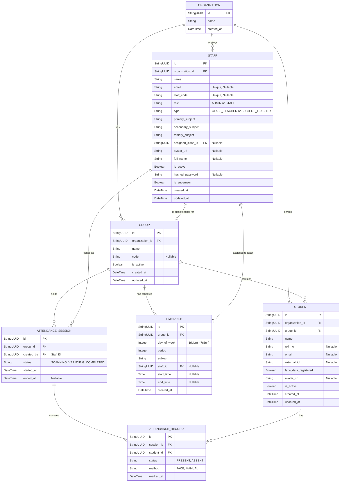

# Smart Presence V4 Premium Database Architecture

This document provides a visualization and overview of the SQLite relational database architecture used by the Smart Presence backend.

## Entity Relationship Diagram (ERD)

The following diagram illustrates the data flow and relationships between all core entities in the system.

## Core Entities Overview

- **Organization**: The top-level tenant representing the school or institution.
- **Group (Class)**: A specific class, section, or group of students.
- **Staff**: Teachers and Administrators. Staff can be assigned as the "Class Teacher" for a group, or assigned to specific subjects across various groups.
- **Student**: The individuals enrolled in a `Group` whose attendance is being tracked. Contains flags for face recognition enrollment.
- **Timetable**: Represents the weekly schedule (periods). Maps a specific subject, staff member, and time block to a specific group on a specific day of the week.
- **Attendance Session**: A discrete event representing the act of taking attendance for a specific `Group`, initiated by a specific `Staff` member.
- **Attendance Record**: Represents one student's attendance result (Present/Absent and the method used) within a specific `Attendance Session`.
