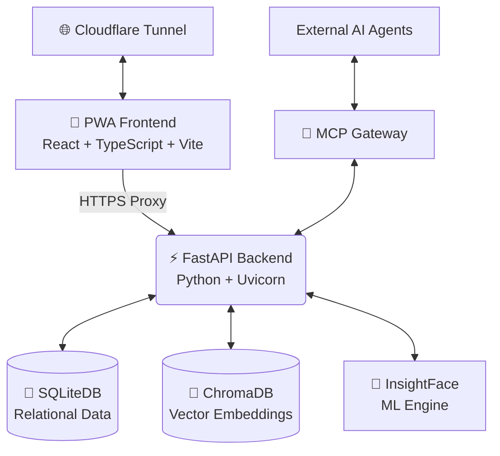

# 🛡️ Smart Presence
**The Ultimate Offline-First, AI-Powered Biometric Attendance System**

---

*Say goodbye to sluggish cloud APIs, expensive subscriptions, and invasive data sharing.*  
*Say hello to **Smart Presence**—where state-of-the-art AI meets zero-trust architecture.*

## 🌟 Why Smart Presence?

Traditional attendance systems are slow, cloud-dependent, and invasive. **Smart Presence** flips the script by prioritizing speed, privacy, and user experience:

- **🔐 100% Zero-Cloud Architecture**: No Supabase, no Firebase, no AWS. Your biometric data and records never leave your local hardware. Complete GDPR & FERPA compliance out of the box.
- **⚡ AI-Native Edge Processing**: Powered by a heavily optimized **InsightFace** engine that runs blazingly fast entirely on standard CPUs. No expensive GPUs required.
- **🤖 Agentic Ready (MCP)**: The world's first attendance system equipped with a built-in **Model Context Protocol (MCP)** bridge, allowing your favorite LLMs (Claude, ChatGPT) to interact with your school data as a local tool.
- **📱 Premium "Liquid Glass" PWA**: A stunning, installable Progressive Web App featuring haptic feedback, 60FPS camera scanning, background animations, and an adaptive UI.

---

## 🏗️ The Survival Architecture

Built to withstand offline environments and poor network conditions, Smart Presence is divided into highly specialized microservices:

| Component | Technology | Role |
| :--- | :--- | :--- |
| **Frontend UI** | React 19 + TypeScript + Tailwind | Premium Admin & Staff Dashboard with Haptics |
| **Backend Core** | FastAPI + Uvicorn | High-performance Python bridge & API |
| **ML Logic** | CPU-Only ONNX Engine | Ultra-fast local face matching |
| **Storage** | SQLite + ChromaDB | Relational data & 512-dim Vector embeddings |
| **Automation** | Full MCP Server | 42+ Tools for AI Agent integration |
| **Networking** | Cloudflare Tunnels | Secure remote access without exposing ports |

---

## 🔥 Key Features

*   **Group & Class Management**: Beautifully manage organizations, classes, students, and schedules.
*   **Rapid Face Enrollment**: Capture 3D angles in seconds right from your phone.
*   **Live Group Scanning**: Scan an entire classroom at once with real-time bounding boxes and confidence tracking.
*   **Haptic Tactile Engine**: Your phone vibrates distinctively on successful scans, errors, and navigation.
*   **Test Class Environment**: Practice and demo the software instantly with the unrestricted `testclass` teacher account.

---

---

## 🚀 Quick Start

Get up and running in minutes:

1.  **Backend**: `cd backend_smart_presence` -> `python -m venv .venv` -> `source .venv/bin/activate` -> `pip install -r requirements.txt` -> `python -m uvicorn app.main:app`
2.  **Frontend**: `cd frontend_smart_presence/frontend_smart_presence` -> `npm install` -> `npm run dev`
3.  **Login**: Use `admin` / `admin` to start managing your organization.

**[Full Installation Guide ➔](./INSTALLATION.md)**

---

## 📚 Documentation

Detailed guides for every part of the system:

1. [**Backend Setup Guide**](./docs/backend.md) - AI engine & database details.
2. [**Frontend Setup Guide**](./docs/frontend.md) - React UI & Design tokens.
3. [**MCP Integration Guide**](./docs/mcp_gateway.md) - AI Agent connection.
4. [**Security Audit**](./docs/security_audit_report.md) - Built with Zero-Trust.
5. [**Cloudflare Tunnel**](./docs/cloudflare_tunnel.md) - Remote access setup.

---

## 🤝 Community & Support

This project is built for the next generation of privacy-conscious institutions.

**Connect with the Developer:**
- **GitHub**: [sylvernjones557](https://github.com/sylvernjones557)
- **Project Link**: [Smart Presence](https://github.com/sylvernjones557/FEB10)

*Built with ❤️ by Sylvester Jones.*
