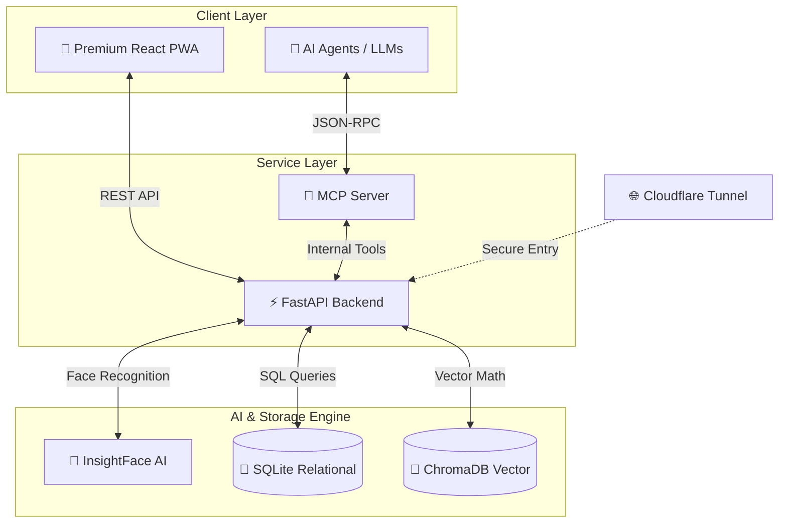
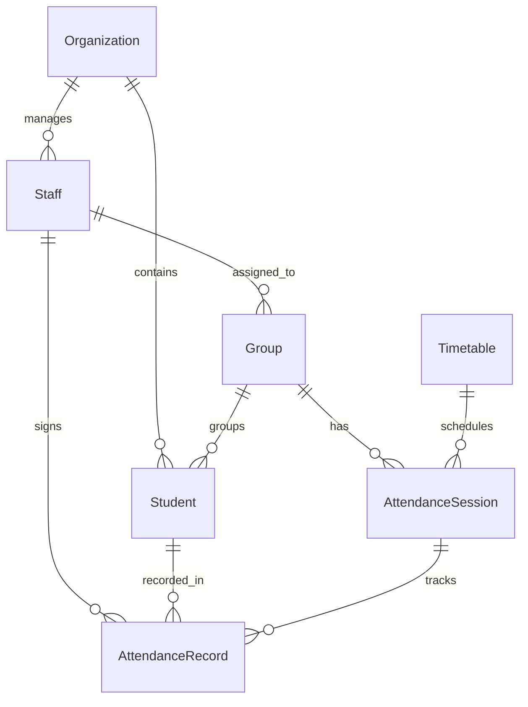
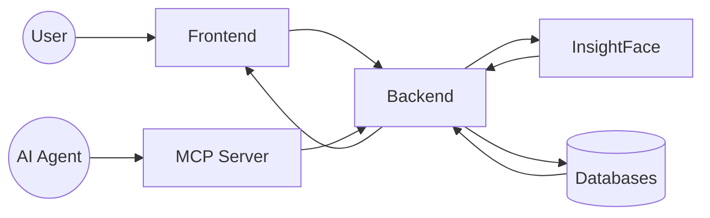
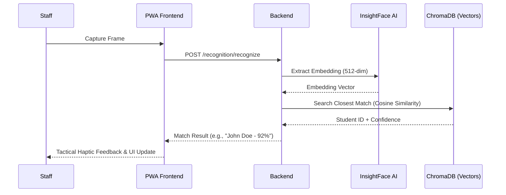

# Smart Presence System Mermaid Diagrams

## 1. Global Architectural Diagram

## 2. Database ER Diagram

## 3. Integrated Data Flow

## 4. Face Recognition Sequence

---
*Updated for V4 Premium with full MCP and AI-Native support.*
