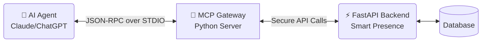

# 🤖 MCP Gateway Guide - Smart Presence V4 Premium

Smart Presence V4 Premium is proud to be the **World’s First Biometric Attendance System** built specifically with AI Agents in mind from day zero. 

By integrating a **Model Context Protocol (MCP)** server natively into the ecosystem, your favorite Large Language Models (LLMs like ChatGPT, Claude, etc.) can "speak" directly to your database as if they were a school administrator.

## What is MCP?
MCP is an open standard that allows AI Assistants to securely access local tools. Instead of building web scrapers or complex API integrations, the AI connects to this MCP server and is instantly granted a list of strictly defined operations it is permitted to execute.

---

## Architecture

Our MCP Gateway sits between the FastAPI Backend and the external AI Client. 



### 🛡️ Pre-Execution Strict Validation
Unlike standard API wrappers, our architecture enforces extreme strictness:
1.  **Pre-Validation Requirements**: Before the MCP server translates a request into a backend API call, it forces the AI to validate the exact schema.
2.  **Duplicate Registrations Blocked**: The server refuses to start if two identical tools are registered.
3.  **Result Guarantees**: Even if an API returns an empty format, the MCP bridge intercepts this and provides the AI with a strict "No Data Found" handler instead of a crashing `null` response.

---

## The 42+ Tool Ecosystem

You can command your AI with simple conversational requests, and the MCP Bridge translates these into the `42+` available backend tools.

*Example requests you can ask Claude Desktop, hooked into the server:*
> *"List all the teachers in my organization."* <br>
> *"Start an attendance session for the 10th-grade class and mark John Doe present if you see him on the camera."* <br>
> *"How many students were absent in the Test Class yesterday?"*

### Tool Categories
*   **Authentication**: Login handlers (e.g., `login_for_access_token`).
*   **Organizations**: Creating, fetching, and updating school structures.
*   **Staff/Groups**: Registering new teachers, adding students to groups.
*   **Attendance**: Managing live active scanning sessions.
*   **Facial Recognition**: Triggering manual recognition events via AI prompts.
*   **Statistics**: Aggregating school-wide presence data.

---

## Configuration

To point your AI Client (like Claude Desktop) to the MCP server, add this configuration to your `claude_desktop_config.json`:

```json
{
  "mcpServers": {
    "smart-presence": {
      "command": "python",
      "args": [
        "E:/smart101/mcp_smart_presence/mcp_server.py"
      ],
      "env": {
        "DATABASE_URL": "sqlite:///E:/smart101/backend_smart_presence/db/sqlite/smart_presence.db"
      }
    }
  }
}
```
*(Ensure you use absolute paths to your local python executable and the DB if running globally).*
