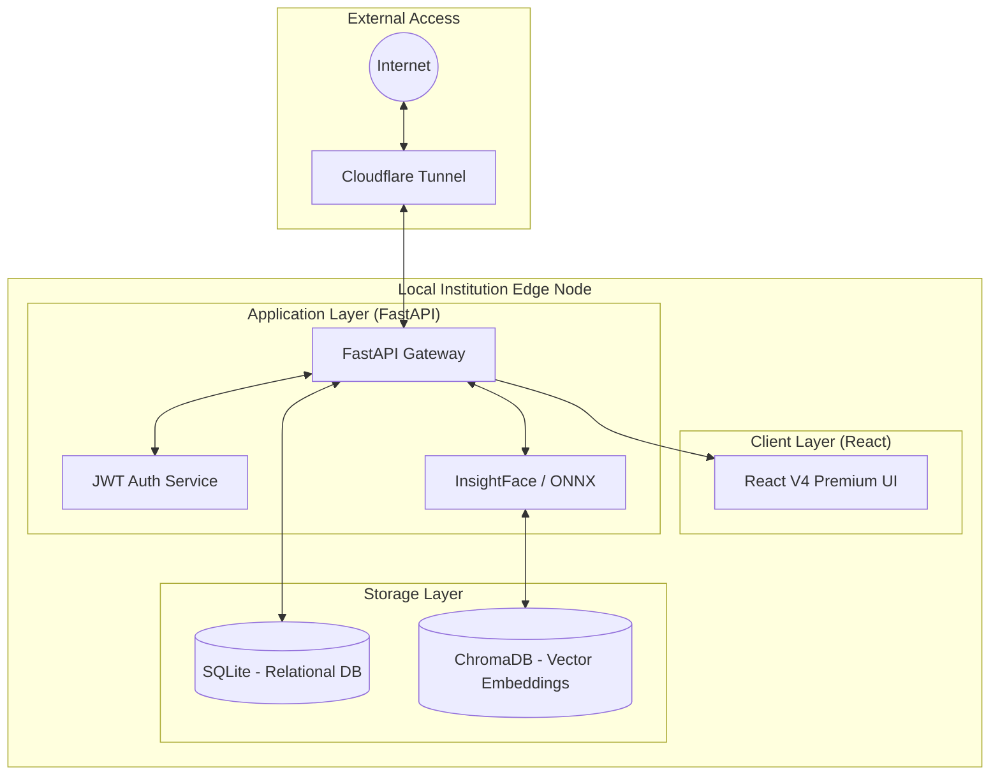
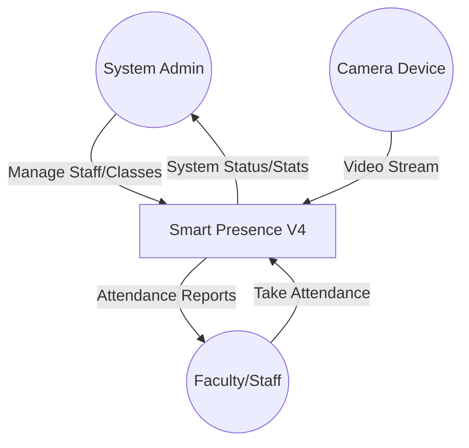
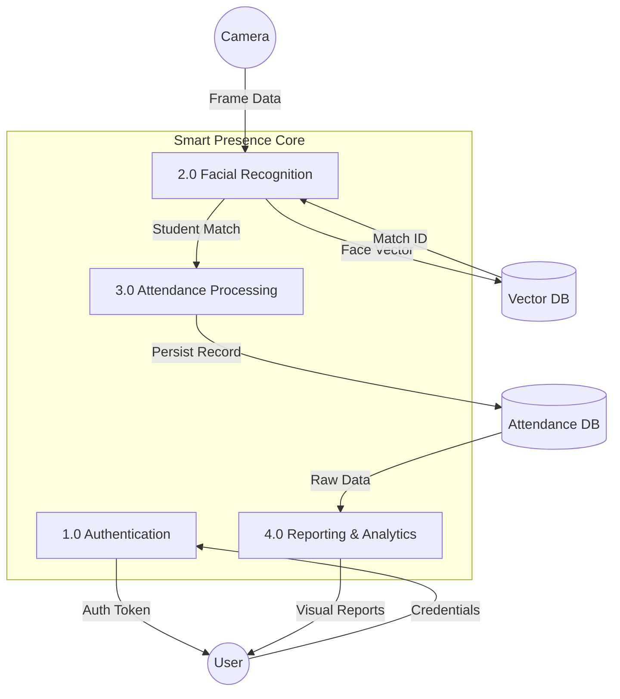

# Smart Presence V4 Premium: System Architecture & Data Flow Diagrams

This document outlines the technical architecture and data flow processes of the Smart Presence system.

---

## 1. System Architecture Diagram
The architecture follows a **Unified Serving Paradigm** where a FastAPI backend serves both the AI logic and the React frontend static files, exposed securely via a Cloudflare Tunnel.

---

## 2. Level 0 Data Flow Diagram (Context)
Visualizes the external entities and their primary interactions with the Smart Presence System.

---

## 3. Level 1 Data Flow Diagram (Processes)
Decomposes the system into its core functional processes and data stores.

---

## 4. Summary of Tech Stack
- **Frontend**: React 19, Tailwind CSS, Lucide Icons.
- **Backend**: FastAPI, Uvicorn.
- **AI**: InsightFace (AntelopeV2), ONNXRuntime.
- **Data**: SQLite (SQLAlchemy), ChromaDB (Vector Search).
- **Network**: Cloudflare Tunnel (HTTPS Bypass).
