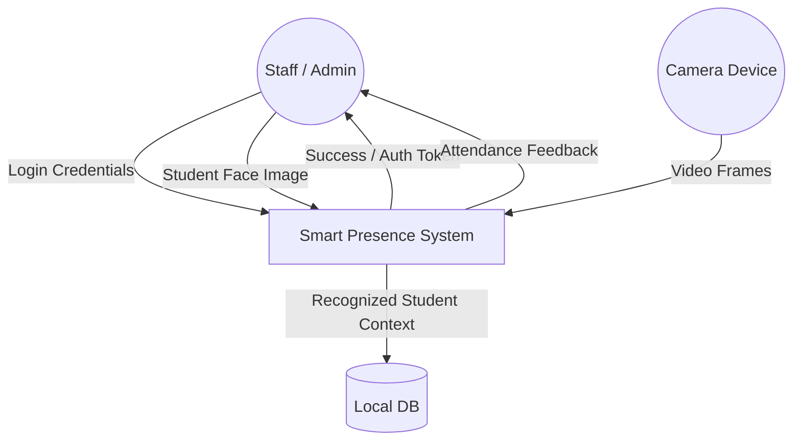
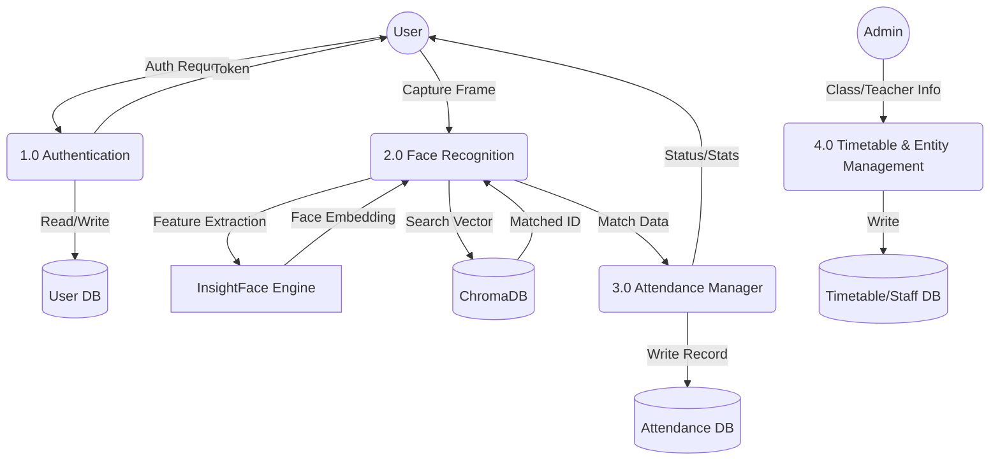
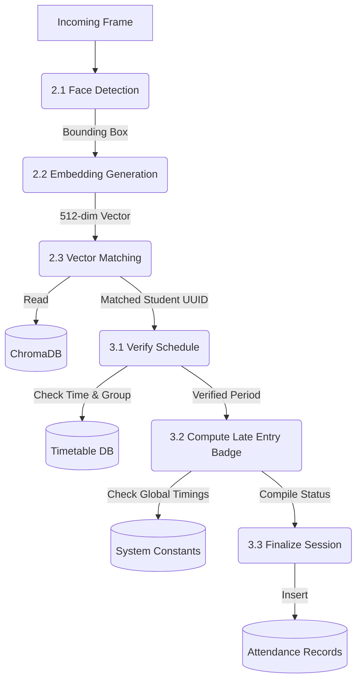

# System Design

## 3.1 Architectural Design
The architecture follows a Zero-Cloud paradigm where the edge node handles both user inferfacing and ML processing locally, ensuring no biometric data leaves the premise.

```mermaid
graph TD
    Client[React Premium PWA] -->|HTTPS Requests| Server(FastAPI + Uvicorn)
    Server <-->|ORM Transactions| SQLite[(Relational DB)]
    Server <-->|512-dim Vector Math| ChromaDB[(Vector DB)]
    Server <-->|Image Arrays| InsightFace Engine
    
    Agents[AI Agents / Claude] <-->|JSON-RPC| MCP[MCP Gateway]
    MCP <--> Server

    Network[Cloudflare Tunnel] -. Secure Over_The_Air .-> Server
```

## Data Flow Diagrams (DFD)

### Level 0 DFD (Context Diagram)
Visualizes system scope at a high level. All external entities interacting with the Smart Presence Application.



### Level 1 DFD
Breaks down the core system into independent processes and the data they exchange.



### Level 2 DFD (Face Recognition & Attendance Process)
A deep dive into the complex sub-process representing matching a face to an ID and storing an attendance slot with correct validation.


